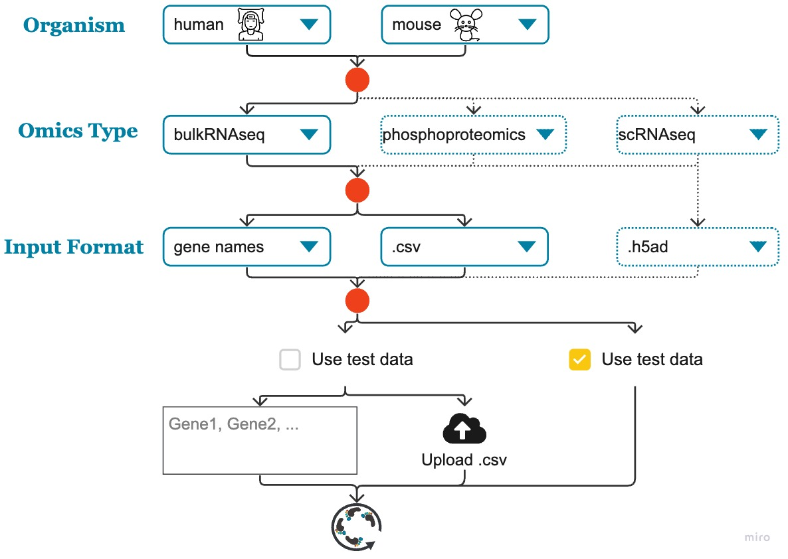
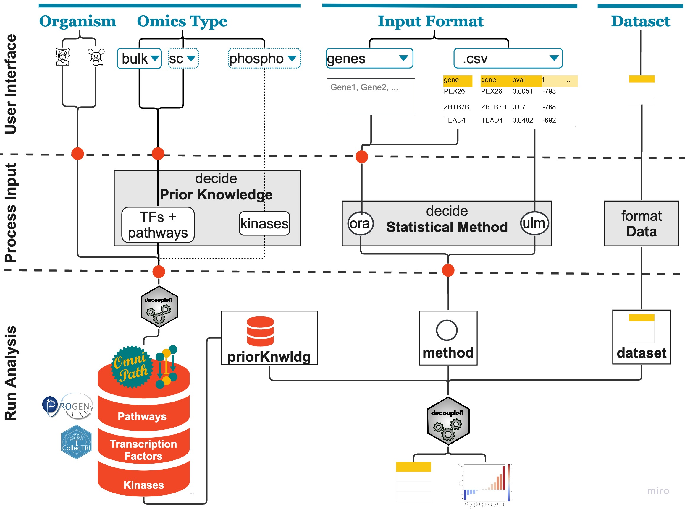

# FUNKI 

FUNKI is a web application that connects prior knowledge with your datasets. It is written in python and uses the package *streamlit* to build the graphical user interface.  
To provide feedback or ask for help, you can open an *issue* in this repository or write to *hanna.schumacher@uni-heidelberg.de* . 
  
</br>
</br>
</br>
</br>
<p align="center">
  <span>The following diagram shows the options that hide behind the dropdown menus in the user interface. Dotted lines show options that are visible but not implemented, yet.</span> </br></br>
  
</p>

</br>
  
<p align="center">
  <span> The following diagram explains how the input from the user interface is processed by FUNKI.   </span> </br></br>
  
</p>

## Local Installation
If you want to install FUNKI locally, for example to use it without internet connection, you can do this in four simple steps: 
1. Install poetry for managing virtual python environments
2. Clone the repository 
3. Initiate the virtual environment by using poetry
4. Run FUNKI

The following code should do this. If you encounter any problems with the poetry installation, you can look through the [official instructions](https://python-poetry.org/docs/#installation). 
```bash
# install poetry 
curl -sSL https://install.python-poetry.org | python3 -
# if the poetry command is not found on your Mac 
# (for other systems, see the offical instructions)
echo 'export PATH="$HOME/.local/bin/:$PATH"' >> ~/.zshrc  
source ~/.zshrc   
# clone repo and enter it
git clone https://github.com/saezlab/FUNKI.git
cd FUNKI
# initiate virtual environment
poetry update
# run FUNKI
poetry run streamlit run Analysis.py
```  
  
  
  
